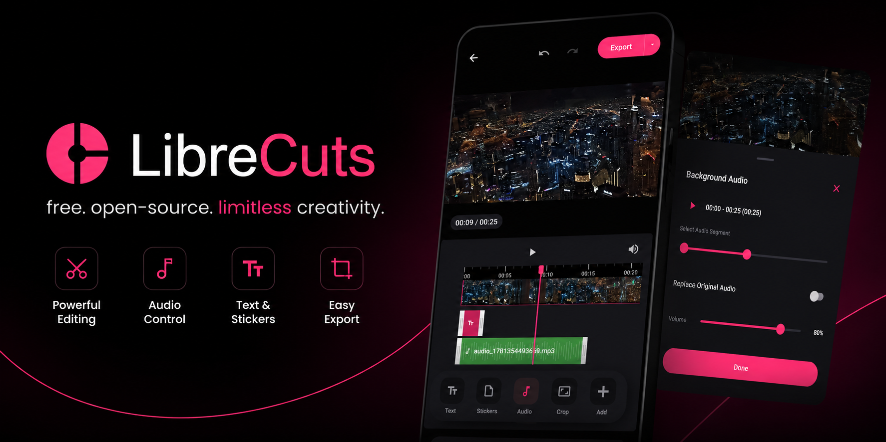
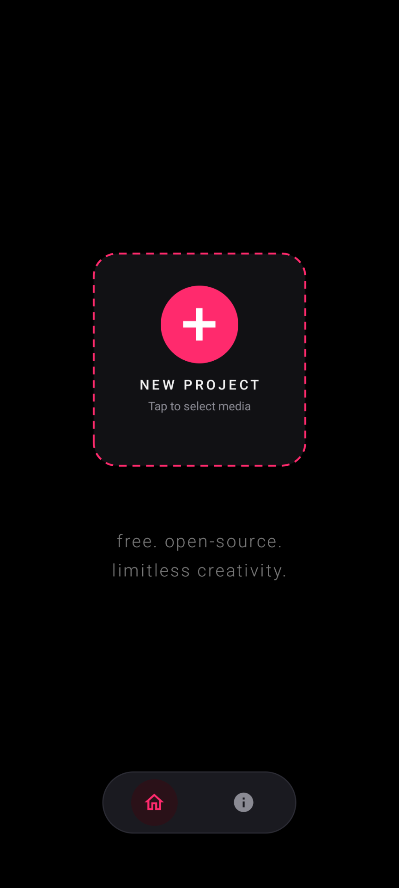
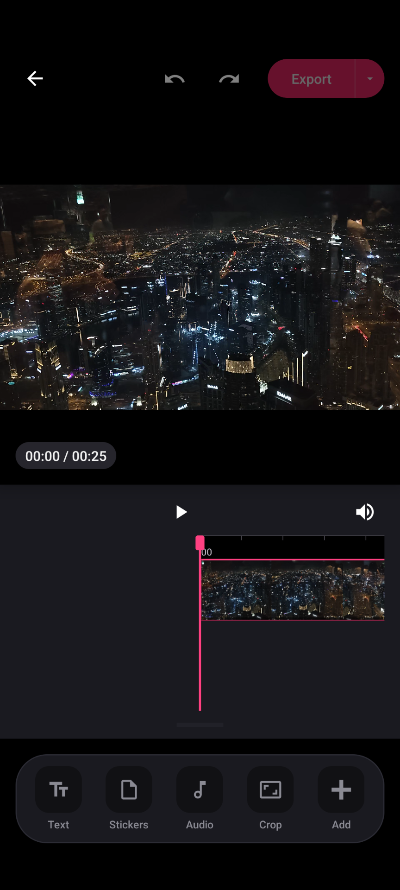
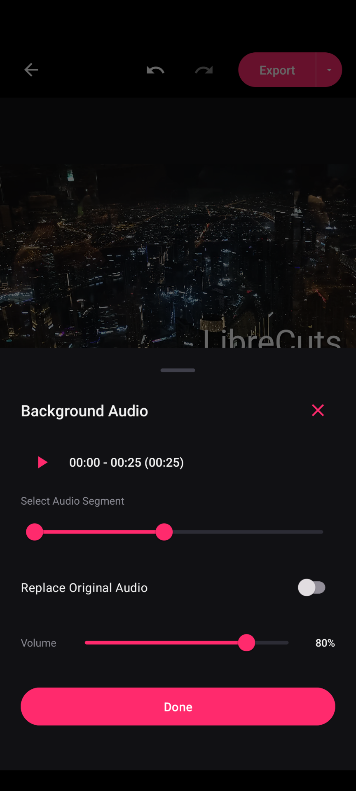
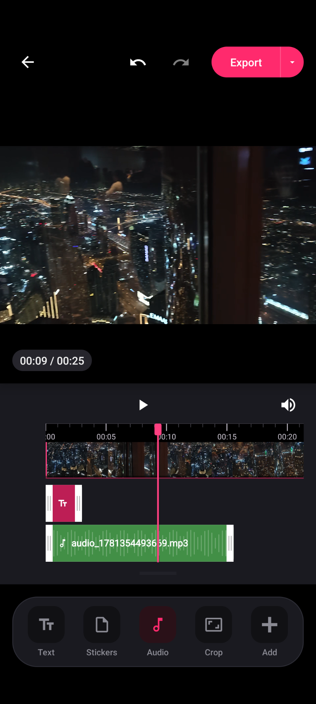

# VidoPRO 🎬

<div align="center">
  
  <br/><br/>

  <a href="https://github.com/Vikash922/Video-editing-/releases/latest">
    
  </a>
  <a href="https://github.com/Vikash922/Video-editing-/actions">
    
  </a>
  <a href="LICENSE">
    
  </a>
  <a href="https://github.com/Vikash922/Video-editing-">
    
  </a>
  <a href="https://github.com/Vikash922/Video-editing-">
    
  </a>

  <br/><br/>

  <a href="https://github.com/Vikash922/Video-editing-/releases/latest">
    
  </a>
</div>

<br/>

**VidoPRO** is a powerful, modern, open-source video editor built for Android. It combines intuitive multi-track timeline editing, smooth real-time scrubbing, advanced hardware acceleration, and complete privacy. All video processing happens **100% locally on your device** — no ads, no trackers, and **zero watermarks**.

---

## 🌟 Highlights & Key Features

### ✂️ Precision Multi-Track Timeline
- **Split & Cut:** Split clips instantly with dedicated scissors control and zero lag. Each segment maintains unique state identification.
- **Drag & Reorder:** Seamlessly drag, arrange, and reorder video segments on the timeline.
- **Trim & Freeze Frame:** High-precision clip trimming and freeze-frame extraction with millisecond accuracy.
- **Thumbnail Strip:** Hardware-assisted background thumbnail caching (`LruCache`) prevents black frames and memory exhaustion.

### 🔍 Interactive Player & Canvas Zoom
- **Pinch-to-Zoom:** Native two-finger pinch-to-zoom on the preview canvas with strict safety limits (`1.0x` to `5.0x`) to avoid memory overload.
- **Double-Tap Reset:** Quickly restore preview scale back to standard 1.0x with a simple double-tap.
- **Fluid Pan:** Smooth pan navigation across zoomed video canvas.

### ⚡ Heavy Media & 4K 60fps Optimization
- **Auto Proxy Generation:** Detects heavy 4K 60fps media and automatically generates smooth 1080p 30fps editing proxies in the background.
- **Full Resolution Final Export:** Proxies are used exclusively for lag-free timeline editing, while final exports utilize the original full-quality 4K source.

### 📐 Multi-Format Aspect Ratios
- Supports all major creator ratios out of the box:
  - **16:9** (YouTube / Widescreen)
  - **9:16** (Reels, TikTok, YouTube Shorts)
  - **1:1** (Square feed posts)
  - **4:5** (Instagram Portrait feed)
  - **4:3** & **Custom Crop**

### 🎨 Overlays, Text & Creative Effects
- **Picture-in-Picture (PIP):** Add multiple video, image, sticker, and GIF overlays on top of the main track.
- **Typography & Custom Fonts:** Add customizable text overlays with support for importing `.ttf` and `.otf` font files.
- **Masking:** Creative mask shapes (circle, rectangle, linear) for overlays and video clips.
- **Chroma Key (Green Screen):** Remove color backgrounds cleanly from overlays.
- **Keyframe Animation:** Animate scale, position, and opacity across time with keyframes.
- **Freehand Drawing:** Draw directly onto video frames with customizable brush sizes and colors.

### 🎵 Advanced Audio Studio
- **Multi-Track Audio:** Import custom music tracks, sound effects, and record voiceovers directly.
- **Audio Controls:** Volume boost up to 200%, ducking, fade-in, fade-out, and original audio mute.
- **Standalone Audio Export:** Export your complete timeline audio as an `.mp3` file.

### 🚀 High-Performance Hardware Rendering
- **MediaCodec Acceleration:** Super-fast video rendering using device GPU hardware encoding (`h264_mediacodec`).
- **Reliable Fallback:** Automatic seamless fallback to software encoding for maximum Android device compatibility.
- **Accurate Real-Time Progress:** Granular percentage tracking and estimated completion time during export.

---

## 📱 Screenshots

<div align="center">
  <table>
    <tr>
      <td align="center"></td>
      <td align="center"></td>
      <td align="center"></td>
      <td align="center"></td>
    </tr>
    <tr>
      <td align="center"><b>Home & Projects</b></td>
      <td align="center"><b>Video Editor</b></td>
      <td align="center"><b>Audio Studio</b></td>
      <td align="center"><b>Multi-Track Timeline</b></td>
    </tr>
  </table>
</div>

---

## 📥 Download & Installation

The latest release APK is ready to download directly from GitHub:

1. Go to the [Releases Page](https://github.com/Vikash922/Video-editing-/releases/latest).
2. Download the latest `VidoPRO-v*.apk` file.
3. Open the APK on your Android device and tap **Install** *(Enable "Install unknown apps" if prompted)*.

---

## 🛠️ Tech Stack & Architecture

- **Language:** Kotlin
- **UI Framework:** Jetpack Compose & Android Modern Material 3 Design
- **Media Playback:** ExoPlayer (Media3) with low-latency buffering control
- **Video Engine:** FFmpeg Kit & Android MediaCodec Hardware Acceleration
- **Image & Thumbnail Pipeline:** Coroutines `Dispatchers.IO`, `MediaMetadataRetriever`, `LruCache`
- **Architecture Pattern:** MVVM (Model-View-ViewModel) + Unidirectional Data Flow (`StateFlow` / `SharedFlow`)

---

## 🏗️ Building from Source

### Prerequisites
- Android Studio Iguana or newer
- Android SDK (API 34)
- JDK 17

### Steps
```bash
# 1. Clone the repository
git clone https://github.com/Vikash922/Video-editing-.git

# 2. Navigate to the project directory
cd Video-editing-

# 3. Build Release APK
./gradlew assembleRelease
```
The generated APK will be located at:
`app/build/outputs/apk/release/`

---

## 🔒 Permissions & Privacy

VidoPRO is built around **privacy by design**:
- **Zero Telemetry:** No user analytics, no background tracking, no remote data collection.
- **Offline First:** All editing and rendering operations run completely offline on your device.
- **Media Permissions:** Used strictly for importing the photos/videos you select and saving exported media to your gallery.

---

## 👤 Author & Maintainer

* **Vikash Singh** - [@Vikash922](https://github.com/Vikash922)

---

## 📄 License

This project is open-source under the [MIT License](LICENSE).
Feel free to use, study, and modify the code.
